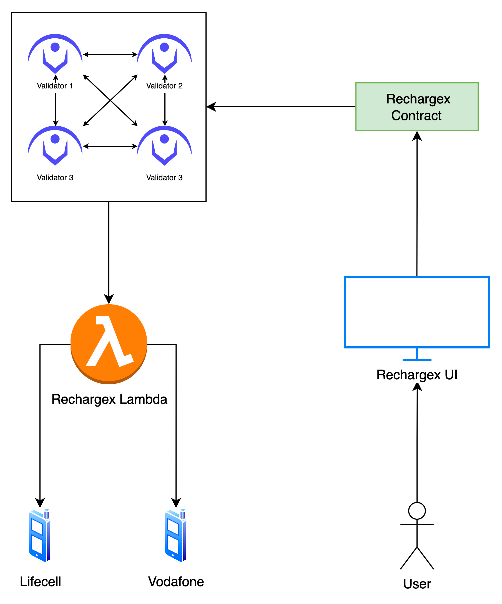
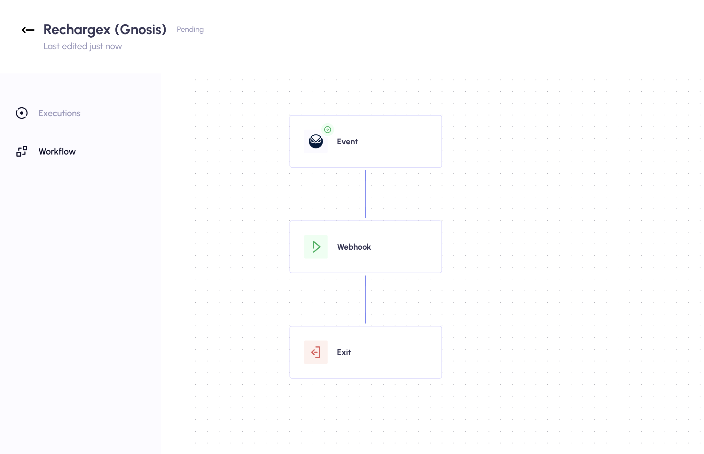

# Nerif Rechargex

Nerif Network powered service created to enable a simple way to top up a phone number by any cryptocurrency on any network without KYC.

Anyone can top up any phone number within few clicks using Metamask or any other crypto wallet. 

*Note: only Metamask is supported at the moment*

## Components

Nerif Rechargex consists of the following components:
1. Rechargex smart contract
2. Nerif Network Workflow
3. AWS Lambda function

### Rechargex Contract

Onchain logic has one smart contract `Rechargex` that accepts payments from users, does swaps and calculations (not implemented yet),
and emmits specific events with the payload. Some of those events are triggers of Nerif Network Workflow execution.

### Nerif Network Workflow

Nerif Network Workflow was created in order to trigger offchain logic with the given payload when a user successfully sent 
a transaction to the smart contract in order to top up its phone number.

### AWS Lambda function

The part that interacts with telecommunication providers via their API is implemented within AWS lambda function written in Go.
This function receives data coming from the smart contract via Nerif Network Workflow. 
When a function is triggered, the logic gets encrypted phone number and amount to charge, identifies what provider to talk with, 
and then executes a specific API call in order to top up the given phone number.

### Chiado Gateway
The application is using the Gnosis Gateway.fm via Nerif Network

